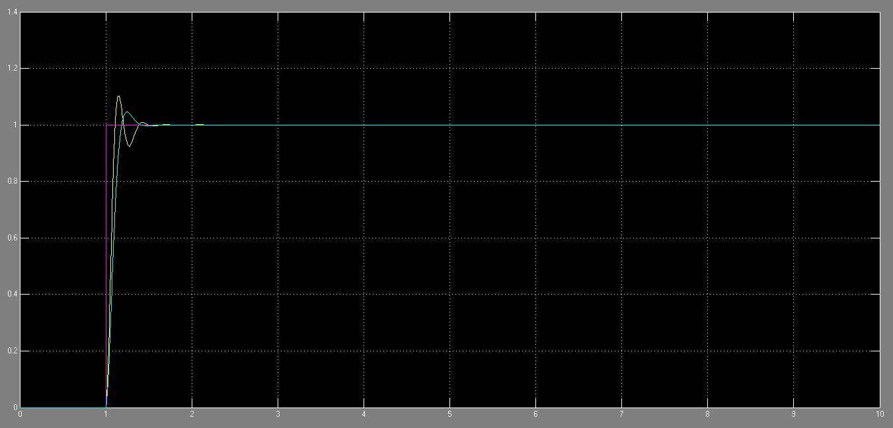

# Speed-Control-of-DC-Motor

# Contents:
1. Abstract
2. Sofwares Used
2. Guide to use

## Abstarct:
In this project,  DC motor speed is controlled using a PID controller and Fuzzy Logic Controller (FLC). PID  controller requires a  mathematical model of the system, whereas the Fuzzy Logic Controller is based on the experience via rule-based knowledge. Design of Fuzzy Logic Controller requires many design decisions, like rule base and fuzzification. The FLC  has two inputs, one of these inputs is the speed error and the second is the change in the speed error. There are 49 fuzzy rules which are designed for the fuzzy logic controller and the center of gravity method is used for defuzzification.  The fuzzy logic controller uses the Mamdani system which employs fuzzy sets in the consequent part. PID controller chooses its parameters based on the auto-tuning method available in MATLAB Simulink. Here PID and FLC are investigated with the help of MATLAB Simulink package program simulation. It is found that FLC is more difficult to design in comparison to that of the PID controller, but it has an advanced control method that is more suitable to satisfy non-linear characteristics of the DC motor. The results show that the fuzzy logic has minimum transient and steady-state parameters, which shows that FLC is more efficient and effective than the PID Controller for a non-linear system.

## Sofwares Used
•	MATLAB Simulink

## Guide to use
Follow the below mentiond steps to perfrom this simulation project in MATLAB Simulink
1. Run the MATLAB Software and then open Simulation library
2. For PID Controller, directly open the PID Controller file and run the simulation.
3. For Fuzzy Logic Controller, place the file ‘’ in the same path as that of the file ‘’ and run the simulation.
4. The output responce of both the controllers is shown in the below picture.

